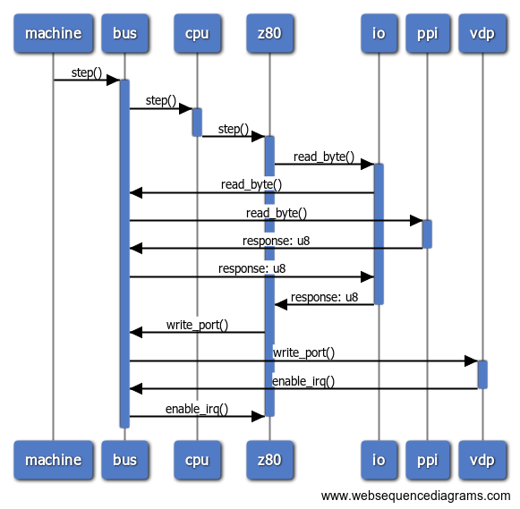

## Modeling Bus and its components in Rust emulator

[Rust Forum Link](https://users.rust-lang.org/t/modeling-bus-and-its-components-in-rust-emulator/92583)

I am writing an emulator and am having a hard time modeling a solution for this problem. Below is what I have so far. I am sure there's a better way to model this problem, and that's exactly what I am looking for.

I have published the example code here: https://github.com/fcoury/emulator-bus-minimal
And there's a [Rust playground link](https://play.rust-lang.org/?version=stable&mode=debug&edition=2021&gist=6c1e5f19cf62bfe6aece4f27ef0beeb9) as well.

I am trying to model the following scenario:

## Structs

- Machine: is the high level abstraction of the hardware, talks via the BUS
- BUS: the orchestrator, talks to the CPU via stepping to next instruction and to the VDP via writing to a given port
- CPU: the CPU, talks to memory via the BUS (not represented here) and to the VDP via the BUS by writing to a given I/O port
- VDP: the graphics chip with VRAM and registers, needs to talk to the CPU to enable/disable interrupts
- PPI: the Programmable Peripheral Interface, talks to the CPU via the BUS

### Flow

- Machine asks CPU to step to next instruction via the BUS
- CPU reads a given memory address and writes to a given VDP port via the BUS
- VDP receives the write and enables interrupts on CPU via the BUS

Here's a sequence diagram illustrating the complete flow:



### Problem

I have one component after the CPU (Z80 implementation) that I don't control. This component needs to read memory via the bus, and for that I need a reentrant lock to the bus.

Back when I was using Rc<RefCell<Bus>>, the flow that manifestates the problem was somewhat like below:

```
Machine.step ->
  Bus.step [borrows Bus mutably] ->
    Cpu.step [borrows CPU mutably] ->
      <Extrenal Cpu implementation>.step ->
        Io.read_byte [borrows BUS mutably] ->
          panic
```

And I was getting this error:

```
thread 'main' panicked at 'already borrowed: BorrowMutError', src/main.rs:61:18
```

```rust
    fn step(&mut self) {
        println!("CPU step");
        self.bus.borrow_mut().write_port(); // <- here
    }
```

### What I tried so far:

- Weak BUS references to CPU/VDP, returning the concrete implementation to the Machine, but the strong reference ended up being dropped
- Returning and keeping the Rc<RefCell<Bus>> to the Machine, and we follow on this reentrant problem
- Refactoring the code to use what **semicoleon** suggested [here](https://users.rust-lang.org/t/modeling-bus-and-its-components-in-rust-emulator/92583/3)

> Well one simple option that doesn't really fix your bigger design question is to just not borrow Bus mutably. It's entire purpose is to be a shared communication channel, so it would likely make more sense to have the Cpu and Vdp in the Bus be inside RefCells instead of the Bus. You're much less likely to have a legitimate reason to borrow Cpu/Vdp mutably twice in the same call stack.  
> One alternate way to model a system like this is via message passing. Instead of making calls directly you send messages between components. In some ways that's closer to how the actual hardware functions, though it can be quite annoying to write code that way. Here's a sketch of how that might work based on that sample code

And [here](https://users.rust-lang.org/t/modeling-bus-and-its-components-in-rust-emulator/92583/8):

> Responses would be most easily modeled by sending a new message back to the original component.  
> You could use something like a response channel, but unless each component has a thread and is waiting on new messages, that doesn't really help you much. You still need to get back to the point where the component checks the channel.

### What I think I need

Change the `ExtCpuIo.read` method to be two-phased:

```rust
    fn read(&self, addr: u16) -> u8 {
        println!("ExtCpuIo read: {:x}", addr);
        self.queue.borrow_mut().push(Message::ReadByte(0x0042));
        let reply = self.queue.process(); // how!? :-)
        if let Message::ReadByteReply(reply) = reply {
            reply
        } else {
            panic!("Unexpected reply");
        }
    }
```

Here, `queue.process` would have to talk to the bus and wait for a reply. I am not sure how to model this.

```rust
    fn process(&self) -> Message {
        let msg = self.pop().unwrap();
        match msg {
            Message::ReadByte(addr) => {
                // ???
                let reply = self.bus.borrow_mut().read_byte(addr);
                Message::ReadByteReply(reply)
            }
            _ => panic!("Unexpected message"),
        }
    }
```

The code as I have it so far is in this repo, be more than welcome to open a PR, or any way you find suitable. Thank you!
